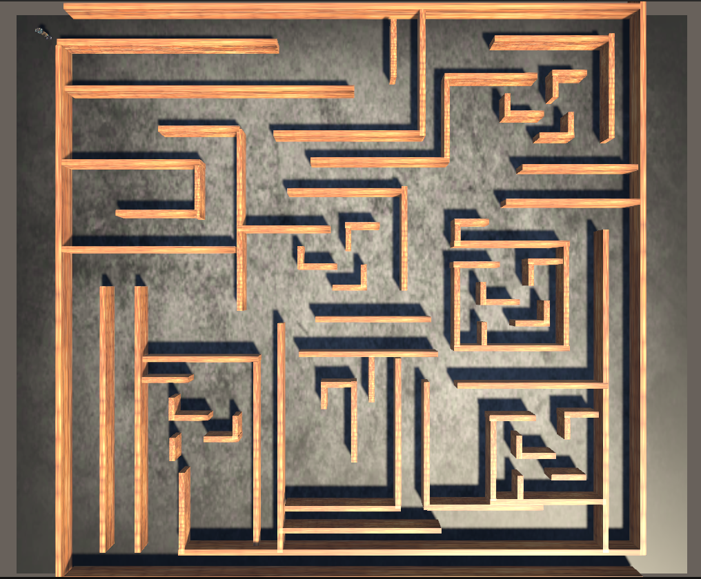

# MazeGame

Unity 6 maze prototype with a third-person animated character, a textured 3D maze, and keyboard movement.

## Project Contents

- `Assets/Scenes/SampleScene.unity`: main playable scene.
- `Assets/PlayerController.cs`: character movement, rotation, gravity, and Animator parameter update.
- `Assets/walking.controller`: Animator Controller with `Idle` and `Walking` states driven by `IsWalking`.
- `Assets/character.fbx`: player character model.
- `Assets/Ch19_nonPBR@Idle.fbx` and `Assets/Ch19_nonPBR@Walking.fbx`: animation clips.
- `Assets/Material/` and `Assets/Material/Materials/`: concrete, wood, and character materials/textures used by the scene.

## Requirements

- Unity `6000.4.2f1` or a compatible Unity 6 editor.
- Input Manager axes `Horizontal` and `Vertical` enabled, as in Unity's default project settings.

## Controls

- `W` / Up Arrow: move forward.
- `S` / Down Arrow: move backward.
- `A` / Left Arrow: move left.
- `D` / Right Arrow: move right.

## Setup

1. Clone the repository.
2. Open the folder with Unity Hub using Unity `6000.4.2f1`.
3. Open `Assets/Scenes/SampleScene.unity`.
4. Press Play and navigate the maze.

Unity-generated folders such as `Library`, `Temp`, `Logs`, `UserSettings`, IDE files, and generated reports are intentionally excluded from Git.
